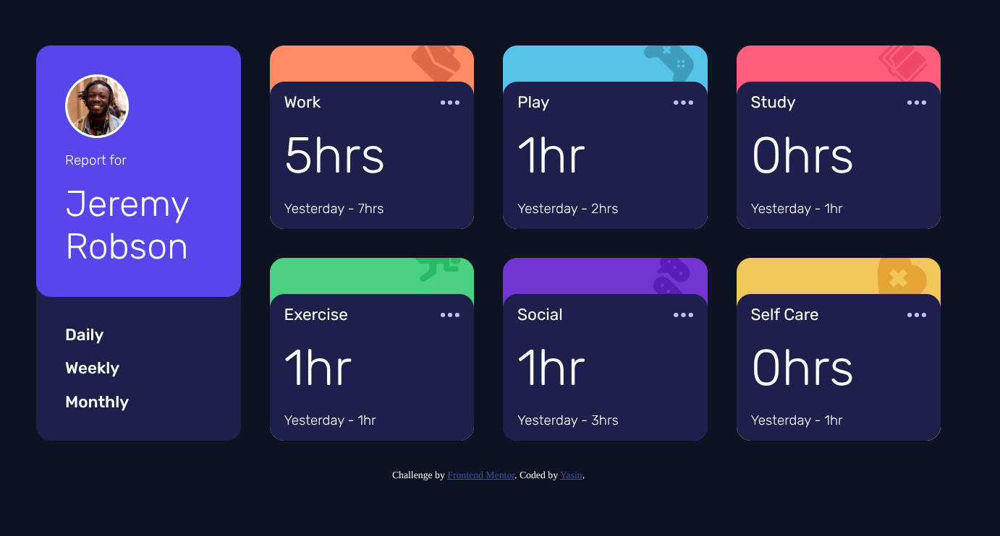

# Frontend Mentor - Time tracking dashboard solution

This is a solution to the [Time tracking dashboard challenge on Frontend Mentor](https://www.frontendmentor.io/challenges/time-tracking-dashboard-UIQ7167Jw). Frontend Mentor challenges help you improve your coding skills by building realistic projects.

## Table of contents

- [Overview](#overview)
  - [The challenge](#the-challenge)
  - [Screenshot](#screenshot)
  - [Links](#links)
- [My process](#my-process)
  - [Built with](#built-with)
  - [What I learned](#what-i-learned)
  - [Continued development](#continued-development)
  - [AI Collaboration](#ai-collaboration)
- [Author](#author)
- [Acknowledgments](#acknowledgments)

## Overview

### The challenge

Users should be able to:

- View the optimal layout for the site depending on their device's screen size
- See hover states for all interactive elements on the page
- Switch between viewing Daily, Weekly, and Monthly stats

### Screenshot

### Links

- Solution URL: [https://github.com/yasinaja/time-tracking-dashboard](https://github.com/yasinaja/time-tracking-dashboard)
- Live Site URL: [https://yasinaja.github.io/time-tracking-dashboard/](https://yasinaja.github.io/time-tracking-dashboard/)

## My process

### Built with

- Semantic HTML5 markup
- CSS custom properties
- Flexbox
- CSS Grid
- Vanilla JS

### What I learned

In this project I learned how to use vanilla JavaScript to drive the UI, especially by leveraging `data-` attributes as the bridge between the markup and the styling. Instead of hardcoding each card's state, I attached `data-` attributes to the elements and then used CSS attribute selectors to style them, so the same CSS variables could control the look of every card consistently. This approach taught me how powerful it is to keep the logic in JavaScript while letting CSS handle the presentation, and how a single source of truth (the `data-` attribute) can keep the HTML, CSS, and JS in sync without duplicating values.

### Continued development

Right now I'm still hunting down a bug with the stacked cards: the topmost card doesn't perfectly cover the card beneath it, even though both are using the same CSS variable for their sizing and positioning. I want to dig into how the stacking context and the shared variable are being resolved so the cards line up exactly, and then make sure the fix holds across the different screen sizes.

### AI Collaboration

I use Kimi for brainstorming

## Author

- Frontend Mentor - [@yasinaja](https://www.frontendmentor.io/profile/yasinaja)
